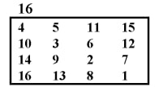

# Отчёт по лабораторной работе №14 по курсу “Фундаментальная информатика”

<b>Студент группы:</b> <ins>M80-108Б-22, Рамалданов Рустамхан Ражудинович, № по списку 17</ins> 

<b>Контакты e-mail:</b> <ins>mrpepelulka@gmail.com</ins>

<b>Работа выполнена:</b> «5» <ins>декабря</ins> <ins>2022</ins> г.

<b>Преподаватель:</b> <ins>асп. каф. 806 Сахарин Никита Александрович</ins>

<b>Входной контроль знаний с оценкой:</b> <ins>______</ins>

<b>Отчет сдан</b> «1» <ins>октября</ins> <ins>2022</ins> г., <b>итоговая оценка</b> <ins>______</ins>

<b>Подпись преподавателя:</b> ________________

## 1. Тема
Вложенные циклы с параметрами. Обход и линеаризация матриц.
## 2. Цель работы
Составить программу ввода квадратной матрицы и печати в строку всех ее элементов в заданном ниже порядке следования.
## 3. Задание (Вариант 16)


## 4. Оборудование:
<b>Процессор:</b> 11th Gen intel(R) Core(TM) i5-11400H @ 2.70GHz<br/>
<b>ОП:</b> 16 ГБ<br/>
<b>SSD:</b> 512 ГБ<br/>
<b>Адрес:</b> 192.168.56.1 <br/>
<b>Монитор:</b> 1920x1080<br/>
<b>Графика:</b> Nvidia GeForce RTX 3050 Ti Laptop GPU <br/>

## 5. Программное обеспечение:
<b>Операционная система семейства:</b> linux(ubuntu) версии 5.15.0-47-generic<br/>
<b>Интерпретатор команд:</b> bash версия 5.1.16<br/>
<b>Система программирования:</b> не использовалась версия —<br/>
<b>Редактор текстов:</b> emacs версия 25.2.2<br/>
<b>Утилиты операционной системы:</b> nano, ls, cd, touch, gcc <br/>
<b>Прикладные системы и программы:</b> GNU C compiler <br/>
<b>Местонахождение и имена файлов программ и данных на домашнем компьютере:</b> /home/pepelulka<br/>

## 6. Идея, метод, алгоритм решения задачи (в формах: словесной, псевдокода, графической [блок-схема, диаграмма, рисунок, таблица] или формальные спецификации с пред- и постусловиями)

Реализуем данное задание с помощью вложенных циклов на языке Си.

## 7. Сценарий выполнения работы [план работы, первоначальный текст программы в черновике (можно на отдельном листе) и тесты либо соображения по тестированию]. 

Код программы:
```a.c
#include <stdio.h>

#define MAX_N 7

void solve() {
    int n;
    scanf("%d", &n);
    int a[MAX_N][MAX_N];
    for (int i = 0;i < n;i++) {
        for (int j = 0;j < n;j++) {
            scanf("%d", &a[i][j]);
        }
    }

    for (int k = 0;k < (2 * n + 1);k++) {
        if (k % 2 == 0) {
            // starting point
            int i = n - 1;
            int j = n - 1 - (k / 2);
            while (i >= 0 && j >= 0) {
                printf("%d ", a[i][j]);
                i--; j--; // going by diagonal
            }
        } 
        else {
            // starting point
            int i = 0;
            int j = 1 + (k / 2);
            while (i < n && j < n) {
                printf("%d ", a[i][j]);
                i++; j++; // going by diagonal
            }
        }
    }
}

int main() {
    solve();
    return 0;
}
```

Пункты 1-7 отчета составляются сторого до начала лабораторной работы.
Допущен к выполнению работы.  
<b>Подпись преподавателя</b> ________________

## 8. Распечатка протокола 

```
C:\Users\user\Desktop\Универ\лабы по инфе\labs\14>a.exe
4
4 5 11 15
10 3 6 12
14 9 2 7
16 13 8 1
1 2 3 4 5 6 7 8 9 10 11 12 13 14 15 16 
C:\Users\user\Desktop\Универ\лабы по инфе\labs\14>
```

## 9. Дневник отладки должен содержать дату и время сеансов отладки и основные события (ошибки в сценарии и программе, нестандартные ситуации) и краткие комментарии к ним. В дневнике отладки приводятся сведения об использовании других ЭВМ, существенном участии преподавателя и других лиц в написании и отладке программы.

| № |  Лаб. или дом. | Дата | Время | Событие | Действие по исправлению | Примечание |
| ------ | ------ | ------ | ------ | ------ | ------ | ------ |
| 1 | дом. | 05.12.2022 | 18:00 | Выполнение лабораторной работы | - | - |
## 10. Замечания автора по существу работы

Замечаний нет.

## 11. Выводы

В процессе работы была освоена работа с вложенными циклами в Си.

Недочёты при выполнении задания могут быть устранены следующим образом: —

<b>Подпись студента:</b> ____________________
